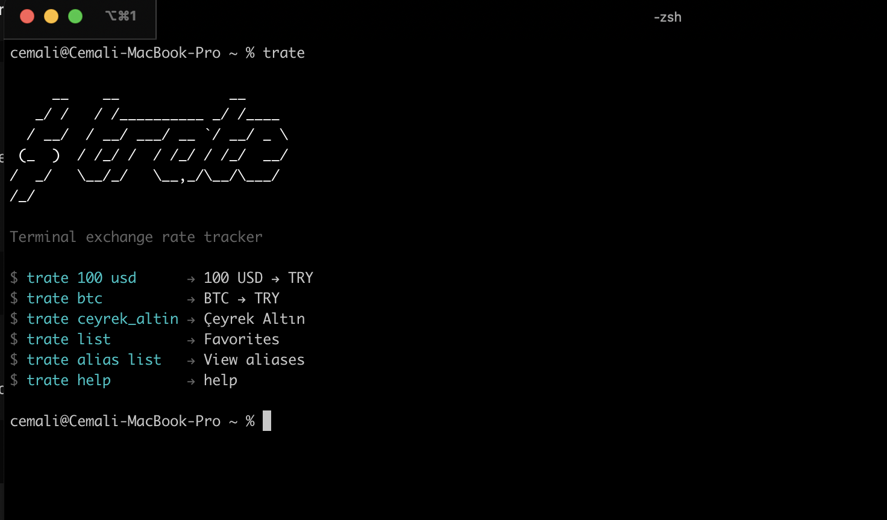

# Trate

> Terminal-based currency tracker - convert fiat, crypto, and precious metals instantly.

[](https://github.com/cemalidev/trate/actions)
[](https://www.npmjs.com/package/trate)
[](https://opensource.org/licenses/MIT)
[](https://nodejs.org/)

## Features

- **Multi-currency support**: Fiat, cryptocurrency, and precious metals
- **Real-time rates**: Live exchange rates from multiple APIs
- **Favorites dashboard**: Track your favorite currencies
- **Multi-language**: English, Turkish, German, French, Spanish
- **Fast & lightweight**: Built with TypeScript and esbuild

## Quick Start

### Install

```bash
npm install -g @cemalidev/trate
```

### Usage

```bash
# Convert currency
trate 100 usd try

# Quick rate lookup
trate btc

# List favorites
trate list
```

## Supported Currencies

| Type             | Examples                                                                            |
| ---------------- | ----------------------------------------------------------------------------------- |
| **Fiat**         | USD, EUR, GBP, JPY, CHF, CAD, AUD, NZD, CNY, HKD, SGD, INR, RUB, TRY, BRL, ZAR, MXN |
| **Crypto**       | BTC, ETH, SOL, BNB, XRP, ADA, DOGE, DOT, AVAX, MATIC, LINK, UNI, LTC, ATOM          |
| **Metals**       | ONS (Gold), GRAM_ALTIN (Gram Gold), GUMUS_OZ (Silver)                               |
| **Turkish Gold** | CEYREK_ALTIN, YARIM_ALTIN, TAM_ALTIN, ATA_ALTIN                                     |

## Commands

| Command                      | Description                          |
| ---------------------------- | ------------------------------------ |
| `trate <amount> <from> <to>` | Convert currency                     |
| `trate <currency>`           | Quick rate lookup                    |
| `trate set-base <currency>`  | Set base currency                    |
| `trate add <currency>`       | Add to favorites                     |
| `trate remove <currency>`    | Remove from favorites                |
| `trate list`                 | Show favorites dashboard             |
| `trate set-lang <lang>`      | Change language (tr, en, de, fr, es) |
| `trate refresh`              | Clear cache                          |
| `trate update`               | Check for updates                    |
| `trate help`                 | Show help                            |

## Custom Aliases

Create shortcuts for currencies you use frequently:

```bash
# Add alias
trate alias add ceyrek CEYREK_ALTIN
trate alias add gram ALTIN_KG
trate alias add gumus GUMUS_OZ

# Use alias in conversions
trate 100 usd ceyrek    # 100 USD → CEYREK_ALTIN
trate ceyrek            # Quick rate lookup

# List all aliases
trate alias list

# Remove alias
trate alias remove ceyrek
```

| Command                        | Description      |
| ------------------------------ | ---------------- |
| `trate alias list`             | List all aliases |
| `trate alias add <alias> <to>` | Add alias        |
| `trate alias remove <alias>`   | Remove alias     |

## Installation from Source

```bash
git clone https://github.com/cemalidev/trate.git
cd trate
npm install
npm run build
npm link
```

## Development

```bash
# Install dependencies
npm install

# Build
npm run build

# Run tests
npm test

# Lint
npm run lint

# Type check
npm run typecheck
```

## Language Support

| Language | Code |
| -------- | ---- |
| Türkçe   | `tr` |
| English  | `en` |
| Deutsch  | `de` |
| Français | `fr` |
| Español  | `es` |

Change language with `trate set-lang <code>`

## Architecture

See [ARCHITECTURE.md](docs/ARCHITECTURE.md) for technical details.

## Contributing

Contributions are welcome! Please see [CONTRIBUTING.md](docs/CONTRIBUTING.md) for guidelines.

## License

MIT License - see [LICENSE](LICENSE) for details.
